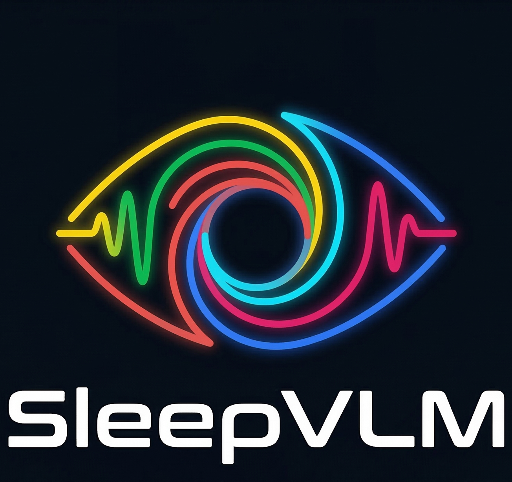
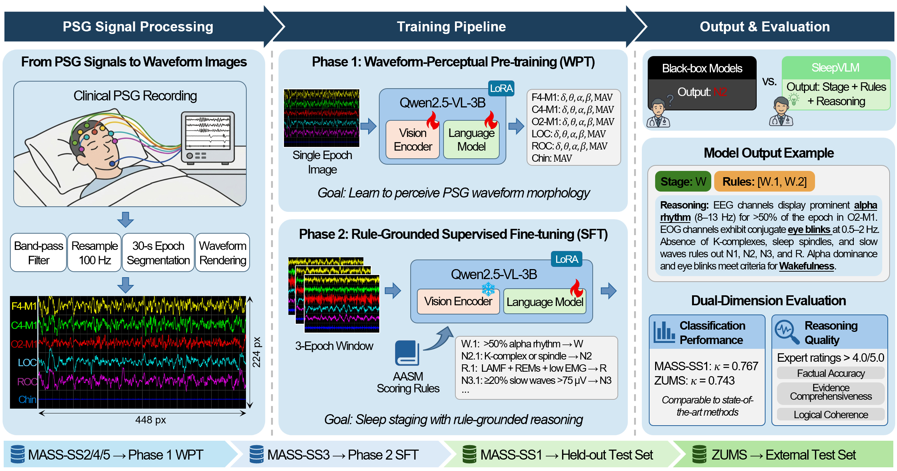

<p align="center">
  
</p>

<h1 align="center">SleepVLM</h1>

<p align="center">
  <strong>Explainable and Rule-Grounded Sleep Staging via a Vision-Language Model</strong>
</p>

<p align="center">
  <a href="#">Paper</a> &nbsp;|&nbsp;
  <a href="https://github.com/Deng-GuiFeng/MASS-EX">MASS-EX Dataset</a> &nbsp;|&nbsp;
  <a href="https://huggingface.co/collections/Feng613/sleepvlm">Model Weights</a>
</p>

---

## Overview

**SleepVLM** is a vision-language model that performs automated sleep staging from rendered polysomnography (PSG) waveform images, mimicking how human sleep technologists visually inspect PSG traces. Unlike conventional black-box classifiers, SleepVLM generates a predicted sleep stage (W, N1, N2, N3, R) together with cited AASM rule identifiers and a clinician-readable natural language rationale. The model is built on [Qwen2.5-VL-3B-Instruct](https://huggingface.co/Qwen/Qwen2.5-VL-3B-Instruct) and fine-tuned via LoRA through a two-phase training pipeline on the [MASS](https://borealisdata.ca/dataset.xhtml?persistentId=doi:10.5683/SP3/9MYUCS) dataset.

<p align="center">
  
</p>

**Figure 1.** SleepVLM pipeline overview. PSG signals are rendered as standardized waveform images, then processed through a two-phase training framework: Phase 1 (waveform-perceptual pre-training) and Phase 2 (rule-grounded supervised fine-tuning).

---

## Getting Started

There are two paths depending on your goal:

**Path A -- Inference only.** Download the pre-trained weights from HuggingFace (see [Pre-trained Models](#pre-trained-models)) and skip directly to the [Inference](#inference) section. You still need to preprocess your PSG data into waveform images (steps 1--3 of Data Preparation).

**Path B -- Full reproduction.** Follow every section below in order, from Installation through Evaluation.

---

## Installation

### Prerequisites

- Python 3.10+
- CUDA 12.1+
- 8 &times; NVIDIA A100 80GB (training) or 1 &times; NVIDIA RTX 4090 24GB (inference with quantization)

### Setup

```bash
# Clone the repository with the MASS-EX submodule
git clone --recurse-submodules https://github.com/Deng-GuiFeng/SleepVLM.git
cd SleepVLM

# Create conda environment
conda create -n SleepVLM python=3.10 && conda activate SleepVLM

# Install training dependencies
pip install -r requirements/train.txt
```

> **Note on separate environments:** Training depends on `transformers` and `peft`, while inference depends on `vLLM`. These can conflict. If you encounter version issues, create a dedicated inference environment:
>
> ```bash
> conda create -n SleepVLM-infer python=3.10 && conda activate SleepVLM-infer
> pip install -r requirements/inference.txt
> ```

---

## Data Preparation

### 1. Download the MASS dataset

Apply for access and download the EDF files from the [MASS repository](https://borealisdata.ca/dataset.xhtml?persistentId=doi:10.5683/SP3/9MYUCS). Place the EDF files into the following directory structure:

```
data/MASS/
├── SS1/edfs/     # 01-01-0001 PSG.edf, 01-01-0001 Base.edf, ...
├── SS2/edfs/     # 01-02-0001 PSG.edf, 01-02-0001 Base.edf, ...
├── SS3/edfs/     # 01-03-0001 PSG.edf, 01-03-0001 Base.edf, ...
├── SS4/edfs/     # 01-04-0001 PSG.edf, ...
└── SS5/edfs/     # 01-05-0001 PSG.edf, ...
```

Place all EDF files into the `edfs/` subdirectory under each subset.

### 2. Download the base model

```bash
huggingface-cli download Qwen/Qwen2.5-VL-3B-Instruct --local-dir models/Qwen2.5-VL-3B-Instruct
```

### 3. Render waveform images

This step preprocesses raw EDF signals (filtering, resampling) and renders 6-channel PSG waveforms as standardized images. Output images are saved to `data/MASS/SS*/images/` and WPT features to `data/MASS/SS*/wpt_features/`.

```bash
bash scripts/preprocess_all.sh
```

This will generate approximately 194,000 images across all subsets.

### 4. Prepare Phase 1 (WPT) training data

Generate the JSONL training file containing spectral and amplitude prediction targets for waveform-perceptual pre-training:

```bash
python scripts/prepare_wpt_data.py
```

### 5. Prepare Phase 2 (SFT) training data

Generate the JSONL training file for rule-grounded supervised fine-tuning. This step uses the MASS-EX annotations (already included via the git submodule in `MASS-EX/`):

```bash
python scripts/prepare_sft_data.py
```

---

## Training

### 6a. Phase 1 -- Waveform-Perceptual Pre-training (WPT)

Train the vision encoder to perceive PSG waveform morphology by predicting per-second spectral and amplitude features from single-epoch images. Data: MASS-SS2/SS4/SS5 (85 subjects). The vision encoder is unfrozen in this phase.

```bash
bash scripts/train_phase1.sh
```

After training completes, merge the LoRA adapter into the base model:

```bash
python scripts/merge_lora.py \
    --adapter_path outputs/phase1_wpt/best \
    --output_path outputs/phase1_wpt/merged
```

### 6b. Phase 2 -- Rule-Grounded Supervised Fine-tuning (SFT)

Fine-tune the model to predict sleep stages with AASM rule citations and reasoning. Data: MASS-SS3 via MASS-EX (50 training subjects, 12 validation subjects). The vision encoder is frozen; LoRA is applied to the language model only. Use the merged Phase 1 checkpoint as the base model:

```bash
MODEL_PATH=outputs/phase1_wpt/merged bash scripts/train_phase2.sh
```

After training completes, merge the LoRA adapter again to prepare for inference:

```bash
python scripts/merge_lora.py \
    --adapter_path outputs/phase2_sft/best \
    --output_path outputs/phase2_sft/merged
```

### 6c. (Optional) W4A16 Post-Training Quantization

Quantize the trained model to 4-bit weights with 16-bit activations (W4A16) using [Intel AutoRound](https://github.com/intel/auto-round) for efficient single-GPU deployment. This reduces model size from ~7 GB to ~3 GB with minimal performance loss.

Quantization requires a separate environment:

```bash
conda create -n SleepVLM-quant python=3.10 && conda activate SleepVLM-quant
pip install -r requirements/quantize.txt
```

Run quantization with stratified calibration data from the SFT training set:

```bash
python scripts/quantize.py \
    --model_path outputs/phase2_sft/merged \
    --output_dir outputs/phase2_sft/quantized_w4a16 \
    --calibration_jsonl data/phase2_sft/train.jsonl \
    --image_base_dir data \
    --num_samples 5000 \
    --seqlen 3140
```

The quantized model can be served with vLLM using `--quantization auto-round --dtype float16` (automatically detected by `run_inference.sh`).

---

## Inference

Inference uses vLLM to serve the model. If you installed training and inference dependencies in separate environments, switch to the inference environment first:

```bash
conda activate SleepVLM-infer
```

Run inference on the MASS-SS1 test set (53 subjects). The script automatically launches one vLLM server per available GPU, runs parallel inference, and shuts down the servers when finished:

```bash
# Using a locally trained checkpoint
MODEL_PATH=outputs/phase2_sft/merged bash scripts/run_inference.sh

# Using pre-trained weights downloaded to models/
MODEL_PATH=models/SleepVLM-3B bash scripts/run_inference.sh
```

Results are saved to `outputs/eval/results.jsonl` by default. Override the output directory with `OUTPUT_DIR`:

```bash
MODEL_PATH=models/SleepVLM-3B OUTPUT_DIR=outputs/eval_bf16 bash scripts/run_inference.sh
```

### Evaluation

Compute classification metrics (accuracy, macro-F1, Cohen's kappa, per-class F1, confusion matrix) from the inference results:

```bash
python scripts/evaluate.py \
    --results_jsonl outputs/eval_bf16/results.jsonl \
    --output_dir outputs/eval_bf16
```

This produces `MASS-SS1_metrics.json` (per-subject and overall metrics) and `evaluation_results.json`.

---

## Pre-trained Models

| Model | Precision | Size | HuggingFace |
|-------|-----------|------|-------------|
| SleepVLM-3B | BF16 | ~7 GB | [Feng613/SleepVLM-3B](https://huggingface.co/Feng613/SleepVLM-3B) |
| SleepVLM-3B-W4A16 | INT4 | ~3 GB | [Feng613/SleepVLM-3B-W4A16](https://huggingface.co/Feng613/SleepVLM-3B-W4A16) |

---

## Project Structure

```
SleepVLM/
├── README.md                          # This file
├── LICENSE                            # Apache License 2.0
├── CITATION.cff                       # Machine-readable citation metadata
├── split.json                         # Train/val/test subject split
├── .gitignore
├── .gitmodules                        # MASS-EX as git submodule
├── requirements/                      # Python dependencies (per environment)
│   ├── train.txt                      #   Training
│   ├── inference.txt                  #   Inference (vLLM)
│   └── quantize.txt                   #   Quantization (AutoRound)
│
├── assets/                            # Logo and figures for README
│   ├── SleepVLM_logo.png
│   └── pipeline.png
│
├── MASS-EX/                           # Git submodule: expert annotations for MASS-SS3
│   ├── annotations/{fine,coarse}/     # Sleep staging annotations
│   ├── scripts/                       # MASS-SS3 preprocessing utilities
│   └── sleep_staging_rules.md         # 15 AASM-based scoring rules
│
├── configs/                           # Reference configuration files (YAML)
│   ├── phase1_wpt.yaml
│   ├── phase2_sft.yaml
│   ├── quantization.yaml
│   └── inference.yaml
│
├── data/                              # Data directory (gitignored, user-generated)
│   └── MASS/
│       ├── SS1/                       # Held-out test set (53 subjects)
│       │   ├── edfs/                  #   Raw EDF files (from MASS)
│       │   └── images/                #   Rendered waveform images
│       ├── SS2/                       # Phase 1 WPT (19 subjects)
│       │   ├── edfs/, images/, wpt_features/
│       ├── SS3/                       # Phase 2 SFT (62 subjects)
│       │   ├── edfs/, images/
│       ├── SS4/                       # Phase 1 WPT (40 subjects)
│       │   ├── edfs/, images/, wpt_features/
│       └── SS5/                       # Phase 1 WPT (26 subjects)
│           ├── edfs/, images/, wpt_features/
│
├── sleepvlm/                          # Main Python package
│   ├── __init__.py
│   ├── data/
│   │   ├── preprocess.py              # Unified MASS preprocessing (all subsets)
│   │   ├── renderer.py                # PSG waveform image rendering
│   │   └── wpt_targets.py             # Phase 1 spectral/amplitude target generation
│   ├── prompts/                       # System prompts for each training phase
│   │   ├── phase1_wpt.md              # WPT system prompt
│   │   ├── phase2_sft_fine.md         # SFT fine-track prompt (with reasoning)
│   │   └── phase2_sft_coarse.md       # SFT coarse-track prompt (rules only)
│   ├── training/
│   │   └── train.py                   # Unified LoRA training (Phase 1 & 2)
│   ├── inference/
│   │   └── predict.py                 # Batch inference via vLLM
│   └── evaluation/
│       ├── metrics.py                 # Acc, Macro-F1, Kappa, bootstrap CI
│       └── parse_output.py            # Parse structured model JSON output
│
└── scripts/                           # CLI scripts & launch helpers
    ├── preprocess_all.sh              # Preprocess all MASS subsets
    ├── prepare_wpt_data.py            # Prepare Phase 1 training JSONL
    ├── prepare_sft_data.py            # Prepare Phase 2 training JSONL
    ├── train_phase1.sh                # Launch Phase 1 WPT training
    ├── train_phase2.sh                # Launch Phase 2 SFT training
    ├── run_inference.sh               # Launch vLLM servers & run inference
    ├── merge_lora.py                  # Merge LoRA adapters into base model
    ├── quantize.py                    # W4A16 post-training quantization
    └── evaluate.py                    # Compute evaluation metrics
```

---

## Datasets

### MASS (Montreal Archive of Sleep Studies)

This project uses the following MASS subsets. Apply for access at the [MASS repository](https://borealisdata.ca/dataset.xhtml?persistentId=doi:10.5683/SP3/9MYUCS).

| Subset | Subjects | Role in SleepVLM | Scoring Standard |
|--------|----------|-------------------|-----------------|
| MASS-SS1 | 53 | Held-out test set | AASM (30-s epochs) |
| MASS-SS2 | 19 | Phase 1 WPT | R&K (20-s epochs) |
| MASS-SS3 | 62 | Phase 2 SFT (5 fine + 45 coarse training, 12 validation) | AASM (30-s epochs) |
| MASS-SS4 | 40 | Phase 1 WPT | R&K (20-s epochs) |
| MASS-SS5 | 26 | Phase 1 WPT | R&K (20-s epochs) |

> **Note:** Phase 1 WPT does not use sleep stage labels -- it trains the model to perceive waveform morphology via spectral/amplitude prediction. The R&K scoring standard and 20-s epoch duration of SS2/SS4/SS5 therefore do not affect WPT supervision targets.

### MASS-EX (Expert Annotations)

[MASS-EX](https://github.com/Deng-GuiFeng/MASS-EX) provides expert-annotated data for all 62 MASS-SS3 subjects, containing:

- **Fine annotations** (5 subjects, 5,006 epochs): sleep stage + AASM rule identifiers + expert-written rationale
- **Coarse annotations** (57 subjects, 54,187 epochs): sleep stage + AASM rule identifiers

MASS-EX is included in this repository as a git submodule. If you cloned with `--recurse-submodules`, the annotations are already present in `MASS-EX/`. See the [MASS-EX README](https://github.com/Deng-GuiFeng/MASS-EX#readme) for details on the annotation pipeline and format.

---

## Citation

If you use SleepVLM or MASS-EX in your research, please cite:

```bibtex
@article{deng2026sleepvlm,
  author  = {Deng, Guifeng and Wang, Pan and Wang, Jiquan and Li, Tao and Jiang, Haiteng},
  title   = {{SleepVLM}: Explainable and Rule-Grounded Sleep Staging
             via a Vision-Language Model},
  journal = {},
  year    = {2026}
}

@dataset{deng2026massex,
  author    = {Deng, Guifeng and Wang, Pan and Li, Tao and Jiang, Haiteng},
  title     = {{MASS-EX}: Expert-Annotated Dataset for Interpretable Sleep Staging},
  year      = {2026},
  publisher = {Zenodo},
  version   = {1.0.0},
  doi       = {}
}
```

---

## License

- **Code:** [Apache License 2.0](LICENSE)
- **MASS-EX annotations:** [CC BY-NC 4.0](MASS-EX/LICENSE)
- **MASS PSG signals:** subject to the [MASS data use agreement](https://borealisdata.ca/dataset.xhtml?persistentId=doi:10.5683/SP3/9MYUCS)

---

## Acknowledgements

This work was supported by the National Science and Technology Major Project, the National Natural Science Foundation of China, and the Key R&D Program of Zhejiang. See the paper for full acknowledgements.

We thank the developers of [Qwen2.5-VL](https://github.com/QwenLM/Qwen2.5-VL), [vLLM](https://github.com/vllm-project/vllm), [Intel AutoRound](https://github.com/intel/auto-round), and the [MASS](https://borealisdata.ca/dataset.xhtml?persistentId=doi:10.5683/SP3/9MYUCS) team for making their resources publicly available.
